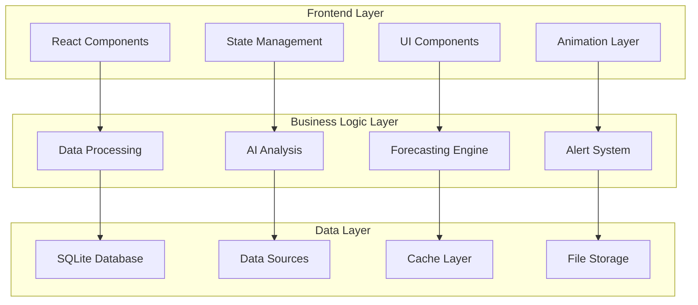
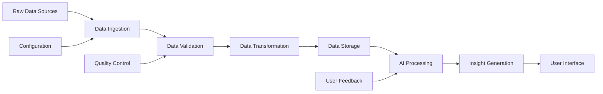
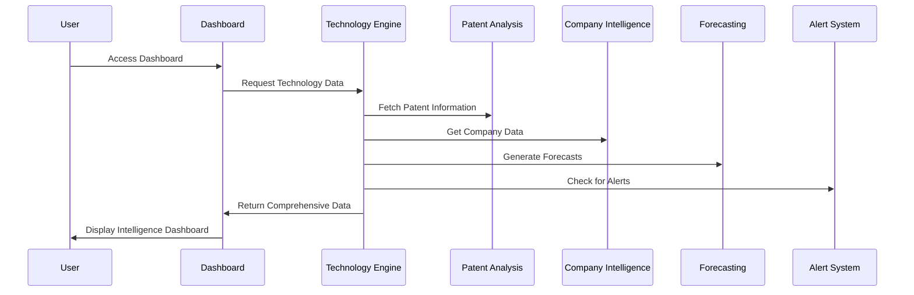
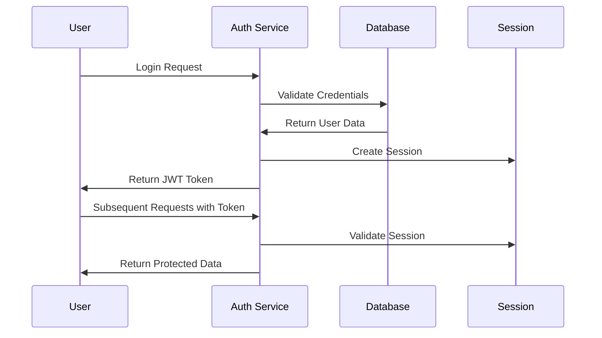
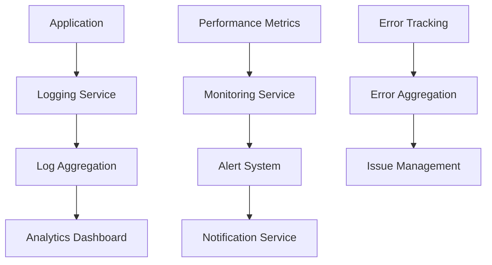
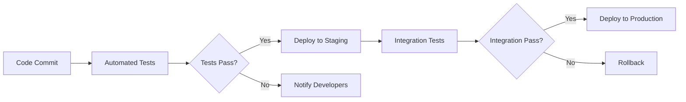
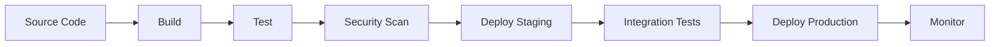

# Technology Intelligence Platform - Technical Documentation

## System Architecture Deep Dive

### Component Architecture



### Data Processing Pipeline



### Technology Intelligence Workflow



## Database Schema

### Core Tables

#### Technologies Table
```sql
CREATE TABLE technologies (
    id TEXT PRIMARY KEY,
    name TEXT NOT NULL,
    description TEXT,
    domain TEXT NOT NULL,
    subdomain TEXT,
    current_trl INTEGER,
    keywords TEXT[],
    status TEXT CHECK (status IN ('mature', 'developing', 'emerging', 'declining')),
    created_at TEXT DEFAULT CURRENT_TIMESTAMP,
    updated_at TEXT DEFAULT CURRENT_TIMESTAMP
);
```

#### Patents Table
```sql
CREATE TABLE patents (
    id TEXT PRIMARY KEY,
    technology_id TEXT REFERENCES technologies(id),
    patent_number TEXT NOT NULL,
    title TEXT NOT NULL,
    abstract TEXT,
    filing_date TEXT,
    publication_date TEXT,
    grant_date TEXT,
    country_code TEXT,
    assignee TEXT,
    inventors TEXT[],
    classification_codes TEXT[],
    citation_count INTEGER,
    legal_status TEXT,
    url TEXT,
    created_at TEXT DEFAULT CURRENT_TIMESTAMP,
    updated_at TEXT DEFAULT CURRENT_TIMESTAMP
);
```

#### Companies Table
```sql
CREATE TABLE companies (
    id TEXT PRIMARY KEY,
    name TEXT NOT NULL,
    description TEXT,
    country TEXT,
    founded_year INTEGER,
    employee_count INTEGER,
    company_type TEXT CHECK (company_type IN ('public_sector', 'large_enterprise', 'startup', 'sme')),
    website TEXT,
    created_at TEXT DEFAULT CURRENT_TIMESTAMP,
    updated_at TEXT DEFAULT CURRENT_TIMESTAMP
);
```

## API Endpoints

### Technology Management
- `GET /api/technologies` - List all technologies
- `POST /api/technologies` - Create new technology
- `PUT /api/technologies/:id` - Update technology
- `DELETE /api/technologies/:id` - Delete technology

### Patent Analysis
- `GET /api/patents` - List patents with filters
- `GET /api/patents/:id` - Get specific patent
- `POST /api/patents/search` - Search patents
- `GET /api/patents/trends` - Get patent trends

### Company Intelligence
- `GET /api/companies` - List companies
- `GET /api/companies/:id` - Get company details
- `GET /api/companies/:id/technologies` - Get company technologies
- `GET /api/companies/investment` - Get investment data

### Forecasting
- `POST /api/forecasts/generate` - Generate forecasts
- `GET /api/forecasts/:id` - Get forecast results
- `GET /api/forecasts/trl-progression` - Get TRL progression
- `GET /api/forecasts/market-size` - Get market predictions

## Security Implementation

### Authentication Flow


### Data Encryption
- **At Rest**: AES-256 encryption for sensitive data
- **In Transit**: TLS 1.3 for all communications
- **Key Management**: Hardware Security Module (HSM)
- **Access Control**: Role-based permissions

## Performance Metrics

### Frontend Performance
- **First Contentful Paint**: < 1.5s
- **Largest Contentful Paint**: < 2.5s
- **Cumulative Layout Shift**: < 0.1
- **First Input Delay**: < 100ms

### Backend Performance
- **API Response Time**: < 200ms (95th percentile)
- **Database Query Time**: < 50ms (average)
- **Data Processing Time**: < 5s (for complex analyses)
- **System Uptime**: 99.9%

## Monitoring & Logging

### Application Monitoring


### Key Metrics Tracked
- **User Activity**: Page views, feature usage, session duration
- **System Performance**: Response times, error rates, throughput
- **Data Quality**: Source reliability, data freshness, accuracy
- **Security Events**: Failed logins, suspicious activities, access violations

## Testing Strategy

### Test Coverage
- **Unit Tests**: 90% code coverage
- **Integration Tests**: All API endpoints
- **End-to-End Tests**: Critical user workflows
- **Performance Tests**: Load and stress testing

### Test Automation


## Deployment Strategy

### Environment Setup
- **Development**: Local development environment
- **Staging**: Pre-production testing environment
- **Production**: Live production environment

### CI/CD Pipeline


## Scalability Considerations

### Horizontal Scaling
- **Load Balancing**: Multiple application instances
- **Database Sharding**: Distributed data storage
- **Caching Strategy**: Redis cluster for session management
- **CDN Integration**: Global content delivery

### Vertical Scaling
- **Resource Optimization**: CPU and memory optimization
- **Database Tuning**: Query optimization and indexing
- **Code Optimization**: Performance profiling and optimization
- **Infrastructure Scaling**: Auto-scaling based on demand

## Disaster Recovery

### Backup Strategy
- **Database Backups**: Daily automated backups
- **File System Backups**: Incremental backups
- **Configuration Backups**: Version-controlled configurations
- **Cross-Region Replication**: Geographic redundancy

### Recovery Procedures
- **RTO (Recovery Time Objective)**: < 4 hours
- **RPO (Recovery Point Objective)**: < 1 hour
- **Failover Procedures**: Automated failover mechanisms
- **Data Validation**: Post-recovery data integrity checks

## Compliance & Standards

### Data Protection
- **GDPR Compliance**: European data protection standards
- **Data Localization**: Indian data residency requirements
- **Classification Handling**: Defense data classification
- **Audit Trails**: Comprehensive activity logging

### Industry Standards
- **ISO 27001**: Information security management
- **NIST Framework**: Cybersecurity framework
- **OWASP Guidelines**: Web application security
- **Defense Standards**: Military-grade security requirements

## Future Roadmap

### Phase 1 (Current)
- ✅ Core platform development
- ✅ Basic technology intelligence
- ✅ Patent analysis capabilities
- ✅ Company intelligence features

### Phase 2 (Next 6 months)
- 🔄 Advanced AI/ML models
- 🔄 Real-time collaboration
- 🔄 Mobile application
- 🔄 Enhanced forecasting

### Phase 3 (Next 12 months)
- 📋 Blockchain integration
- 📋 IoT data integration
- 📋 Global expansion
- 📋 Advanced analytics

## Support & Maintenance

### Support Levels
- **Level 1**: Basic user support and troubleshooting
- **Level 2**: Technical issue resolution
- **Level 3**: System architecture and development
- **Level 4**: Vendor and third-party support

### Maintenance Schedule
- **Daily**: System health checks and monitoring
- **Weekly**: Performance optimization and updates
- **Monthly**: Security patches and feature updates
- **Quarterly**: Major system upgrades and reviews

---

*This documentation provides comprehensive technical details for the Technology Intelligence Platform, ensuring maintainability, scalability, and security for defense applications.*
