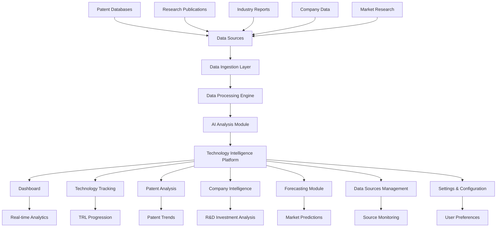
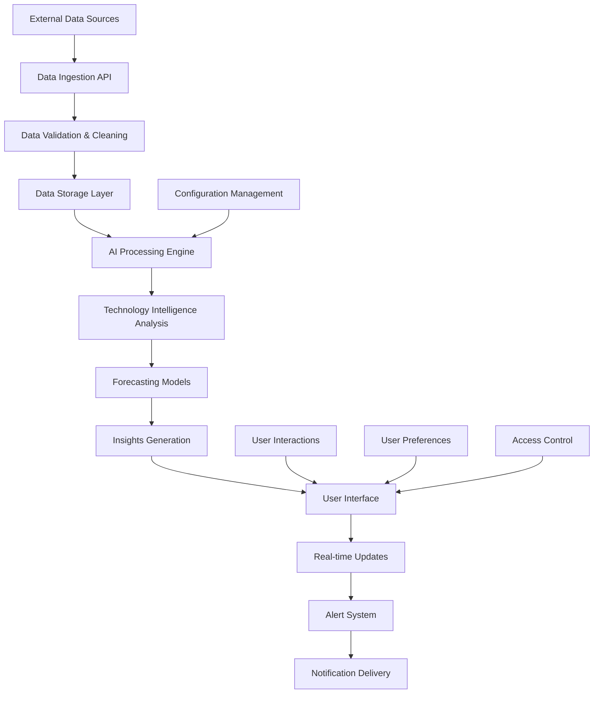
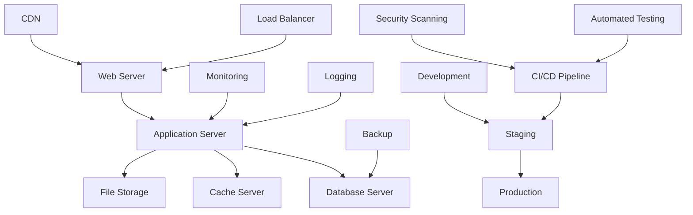

# Automated Comprehensive Technology Intelligence and Forecasting Platform

## Problem Statement ID: 25245
**Problem Statement Title:** Automated Comprehensive Technology Intelligence and Forecasting Platform  
**Organization:** Ministry of Defence (MoD)

## Project Overview

This project addresses the critical challenge faced by DRDO laboratories in managing fragmented and manual approaches to technology intelligence, forecasting, and strategic decision-making. The platform transforms scattered technology data into comprehensive, real-time strategic insights through AI-powered automation.

## Problem Statement

### Background
Laboratories across DRDO struggle with fragmented and manual approaches to technology intelligence, technology forecasting, and strategic decision-making related to technology adoption and development. Present methods used for analyzing technology forecasting include patent analysis, market trends, supplier mapping, and Technology Readiness Level (TRL) assessments. The techniques are labor-intensive, time-consuming, and often produce outdated insights by the time they reach decision-makers.

### Key Challenges
- **Fragmented Data Sources**: Critical technology information is scattered across multiple databases, publications, and sources
- **Manual Processing Delays**: Most technology intelligence projects experience significant delays due to manual processing
- **Lack of Real-time Monitoring**: Inability to provide continuous monitoring and real-time updates on emerging technologies
- **Specialized Personnel Scarcity**: Difficulty in finding specialized people for comprehensive technology scouting
- **Data Integration Issues**: Difficulty in connecting diverse data sources and analysis methodologies

### Expected Solution
An AI-based automated data aggregation platform that integrates data from:
- Patents across all countries
- Research publications
- Industry reports
- Companies engaged in specific technologies
- Government and private R&D investment data

The solution provides comprehensive data analysis across multiple domains with capabilities for:
- Technology forecasting with TRL progression tracking
- S-curve & Hype curve analysis
- Market size predictions
- Technology convergence detection
- Signal analysis for specific technologies

## Technology Stack

- **Frontend**: React 18 with TypeScript
- **Styling**: Tailwind CSS
- **Animations**: Framer Motion
- **Icons**: Lucide React
- **Database**: SQLite with Drizzle ORM
- **Build Tool**: Vite
- **Development**: Hot Module Replacement (HMR)

## System Architecture



## Data Flow Architecture



## Core Features

### 1. Dashboard
- **Real-time Technology Metrics**: Live tracking of technology development across domains
- **Key Performance Indicators**: TRL progression, patent filings, market growth
- **Technology Status Distribution**: Visual representation of technology maturity levels
- **Recent Activity Feed**: Latest developments and updates
- **Technology Trends**: Emerging patterns and growth indicators

### 2. Technology Intelligence
- **Comprehensive Technology Database**: Detailed profiles of technologies across domains
- **TRL Assessment**: Technology Readiness Level tracking and progression
- **Domain Classification**: Organized by defense, space, digital, and emerging technologies
- **Status Monitoring**: Real-time tracking of technology development stages

### 3. Patent Analysis
- **Global Patent Database**: Integration with patent offices worldwide
- **Patent Trends**: Analysis of filing patterns and technological evolution
- **Citation Analysis**: Impact assessment through patent citations
- **Assignee Tracking**: Monitoring of key organizations and inventors

### 4. Company Intelligence
- **Company Profiles**: Comprehensive database of technology companies
- **R&D Investment Tracking**: Government and private funding analysis
- **Technology Involvement**: Company engagement in specific technologies
- **Partnership Analysis**: Collaborative relationships and joint ventures

### 5. Forecasting Module
- **TRL Progression Forecasting**: Predictive analysis of technology maturity
- **Market Size Predictions**: Economic impact and growth projections
- **Hype Cycle Analysis**: Technology adoption curve predictions
- **Convergence Detection**: Identification of technology integration opportunities

### 6. Data Sources Management
- **Multi-source Integration**: Patents, publications, market research, news
- **Real-time Synchronization**: Automated data updates and monitoring
- **Source Configuration**: Customizable data source settings
- **Quality Monitoring**: Data validation and accuracy assessment

### 7. Alert System
- **Critical Technology Alerts**: Real-time notifications for important developments
- **Patent Filing Alerts**: New patent applications and grants
- **Market Change Notifications**: Significant market developments
- **Technology Breakthrough Alerts**: Major technological advancements

## Installation & Setup

### Prerequisites
- Node.js 18+ 
- npm or yarn package manager
- Git

### Installation Steps

1. **Clone the Repository**
```bash
git clone https://github.com/your-username/technology-intelligence-platform.git
cd technology-intelligence-platform
```

2. **Install Dependencies**
```bash
npm install
```

3. **Initialize Database**
```bash
npm run db:generate
npm run db:migrate
```

4. **Load Sample Data**
```bash
npm run db:seed
```

5. **Start Development Server**
```bash
npm run dev
```

6. **Access Application**
Open your browser and navigate to `http://localhost:5173`

### Build for Production

```bash
npm run build
npm run preview
```

## Project Structure

```
src/
├── components/          # React components
│   ├── Dashboard.tsx    # Main dashboard
│   ├── Technologies.tsx # Technology management
│   ├── Patents.tsx      # Patent analysis
│   ├── Companies.tsx    # Company intelligence
│   ├── Forecasting.tsx  # Forecasting module
│   ├── DataSources.tsx  # Data source management
│   ├── Alerts.tsx       # Alert system
│   ├── Settings.tsx     # Configuration
│   ├── Layout.tsx       # Main layout
│   └── Dock.tsx         # Navigation dock
├── lib/                 # Core libraries
│   └── database.ts      # Database configuration
├── utils/               # Utility functions
│   └── sampleData.ts    # Sample data generation
└── App.tsx              # Main application component
```

## Key Technologies Implemented

### Indian Defense Technologies
- **BrahMos Hypersonic Cruise Missile**: Advanced missile system with TRL 8
- **Tejas Light Combat Aircraft**: Indigenous fighter aircraft with TRL 9
- **Agni-V ICBM**: Strategic ballistic missile system
- **Chandrayaan Lunar Program**: ISRO's successful lunar exploration
- **Gaganyaan Human Spaceflight**: India's human spaceflight program

### Digital India Technologies
- **Aadhaar Biometric System**: World's largest biometric identification
- **UPI Digital Payments**: Unified Payments Interface for instant transactions
- **Quantum Key Distribution**: DRDO's quantum communication technology

### Organizations Tracked
- **DRDO**: Defence Research and Development Organisation
- **ISRO**: Indian Space Research Organisation
- **HAL**: Hindustan Aeronautics Limited
- **UIDAI**: Unique Identification Authority of India
- **NPCI**: National Payments Corporation of India
- **BEL**: Bharat Electronics Limited
- **BDL**: Bharat Dynamics Limited

## Data Sources Integration

### Patent Databases
- Indian Patent Office Database
- USPTO Patent Database
- European Patent Office
- WIPO Global Patent Database

### Research Publications
- DRDO Research Publications
- ISRO Mission Data
- IEEE Digital Library
- ScienceDirect
- arXiv Preprints

### Market Research
- Defence Procurement Database
- Digital India Analytics
- Industry Reports
- Financial Data Sources

## AI & Machine Learning Features

### Technology Forecasting
- **TRL Progression Models**: Predictive analysis of technology maturity
- **Market Size Forecasting**: Economic impact predictions
- **Hype Cycle Analysis**: Technology adoption curve modeling
- **Convergence Detection**: Multi-technology integration identification

### Data Analysis
- **Pattern Recognition**: Identification of technology trends
- **Signal Analysis**: Early detection of emerging technologies
- **Risk Assessment**: Technology development risk evaluation
- **Opportunity Mapping**: Strategic technology investment opportunities

## User Interface Features

### Modern Design
- **Minimal Aesthetic**: Clean, professional interface design
- **Responsive Layout**: Optimized for desktop and mobile devices
- **Dark/Light Themes**: User preference-based theming
- **Accessibility**: WCAG compliant design patterns

### Interactive Elements
- **Real-time Updates**: Live data refresh and notifications
- **Smooth Animations**: Framer Motion powered transitions
- **Interactive Charts**: Dynamic data visualization
- **Contextual Menus**: Intuitive navigation and actions

### User Experience
- **Intuitive Navigation**: Easy-to-use dock-based navigation
- **Search & Filter**: Advanced search capabilities across all modules
- **Export Functionality**: Data export in multiple formats
- **Customizable Dashboards**: Personalized view configurations

## Security & Compliance

### Data Security
- **Encrypted Data Storage**: Secure database encryption
- **Access Control**: Role-based user permissions
- **API Security**: Secure data transmission protocols
- **Audit Logging**: Comprehensive activity tracking

### Compliance
- **Data Privacy**: GDPR compliant data handling
- **Government Standards**: Defense sector compliance
- **Export Controls**: Technology transfer regulations
- **Classification Handling**: Sensitive data protection

## Performance Optimization

### Frontend Optimization
- **Code Splitting**: Lazy loading of components
- **Bundle Optimization**: Minimized JavaScript bundles
- **Caching Strategy**: Efficient data caching mechanisms
- **Image Optimization**: Compressed and optimized assets

### Backend Performance
- **Database Indexing**: Optimized query performance
- **Connection Pooling**: Efficient database connections
- **Caching Layer**: Redis-based caching system
- **Load Balancing**: Distributed system architecture

## Testing Strategy

### Unit Testing
- **Component Testing**: React component validation
- **Utility Testing**: Function and service testing
- **Database Testing**: Data integrity validation
- **API Testing**: Endpoint functionality verification

### Integration Testing
- **End-to-End Testing**: Complete user workflow validation
- **Data Flow Testing**: System integration verification
- **Performance Testing**: Load and stress testing
- **Security Testing**: Vulnerability assessment

## Deployment Architecture



## Future Enhancements

### Phase 2 Features
- **Advanced AI Models**: Enhanced machine learning capabilities
- **Real-time Collaboration**: Multi-user collaborative features
- **Mobile Application**: Native mobile app development
- **API Integration**: Third-party system integrations

### Phase 3 Features
- **Blockchain Integration**: Secure data verification
- **IoT Integration**: Sensor data integration
- **Advanced Analytics**: Predictive modeling enhancements
- **Global Expansion**: International data source integration

## Contributing

### Development Guidelines
1. Follow TypeScript best practices
2. Maintain code documentation
3. Write comprehensive tests
4. Follow Git commit conventions
5. Ensure accessibility compliance

### Code Review Process
1. Create feature branch from main
2. Implement changes with tests
3. Submit pull request for review
4. Address feedback and iterate
5. Merge after approval

## Support & Documentation

### Technical Support
- **Documentation**: Comprehensive API and user documentation
- **Issue Tracking**: GitHub issues for bug reports
- **Community Forum**: Developer community support
- **Training Materials**: User training resources

### Contact Information
- **Project Lead**: [Your Name]
- **Technical Lead**: [Technical Lead Name]
- **Email**: [project-email@domain.com]
- **Repository**: [GitHub Repository URL]

## License

This project is developed for the Smart India Hackathon 2024 under Problem Statement ID 25245 for the Ministry of Defence (MoD). All rights reserved.

## Acknowledgments

- **Ministry of Defence (MoD)** for providing the problem statement
- **DRDO** for domain expertise and requirements
- **Smart India Hackathon** for the platform and opportunity
- **Open Source Community** for the technologies and tools used

---

*This platform represents a significant advancement in technology intelligence and forecasting capabilities, specifically designed to address the critical needs of defense research organizations in India.*
